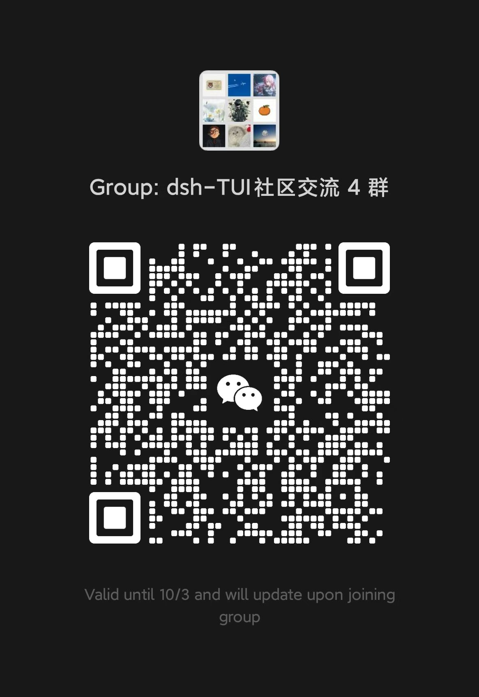

<p align="center">
  
</p>
<p align="center">
  <a href="README.md">English</a> | <strong>简体中文</strong>
</p>

<p align="center">
  <a href="https://www.npmjs.com/package/@deepseek-harness-tui/dsh-tui"></a>
  <a href="https://github.com/ccch1mneyyy/dsh-TUI/actions/workflows/ci.yml"></a>
  <a href="LICENSE"></a>
  
  <a href="https://github.com/ccch1mneyyy/dsh-TUI/stargazers"></a>
  <a href="https://www.npmjs.com/package/@deepseek-harness-tui/dsh-tui"></a>
  
</p>

# dsh-TUI

> 面向 DeepSeek Harness 的交互式终端界面插件：像素鲸鱼顶栏、实时工作状态、流式思考展示、双击 Esc 时间回溯、上下文进度条与 TPS 仪表。
> 零核心改动，纯插件挂载。安装即启用，卸载不留核心补丁。

## 功能亮点

- **像素鲸鱼娘** — 开屏三选一动画，点击唤醒；开始第一个任务后定格。
- **终端原生界面** — 流式 Markdown、工具卡、`/` 与 `@` 补全、`#L12-14` 行区间、历史搜索、中英界面。
- **图片** — Kitty/Sixel 缩略图，居中大图可缩放平移，粘贴前按限额适配，无图形时文字回退。
- **Mermaid 图表** — ```` ```mermaid ```` 代码块画成 Unicode 字符图。
- **时间轴** — 全部回合可点；右栏时间线 / 滚动条 / 隐藏。
- **实时状态** — 工作动画、上下文条、TPS、缓存命中率、推理强度、token、Git 与会话信息。
- **唯一的会话管理界面** — `/resume` `/home` `/agentview` `/bg` `⌸`。
- **会话工作流** — `/new` `/compact` `/export` `/btw`、模型热切换、fork、回溯、vim、全屏草稿编辑器。
- **IDE 选区通道** — VS Code 里选中的代码进 prompt。
- **DSH 集成** — presets、技能、MCP、目标、待办、子代理、问卷。
- **扩展** — 浏览器交互、computer use 等。
- **为长会话设计** — 事件驱动投影、虚拟化、有界缓存。

键位与命令：[交互与命令](docs/interaction.md)。其余见[文档索引](docs/README.md)。

## 界面预览

<picture>
  <source media="(max-width: 640px)" srcset="docs/assets/readme/preview-zh-mobile.svg">
  
</picture>

## 官方收录

本插件被 **DeepSeek Harness 官方公众号**推文收录，也被 [dshfind](https://dshfind.com/ccch1mneyyy/dsh-TUI) 插件目录收录，并登上 [GitHub Trending](https://trendshift.io/repositories/146168) 日榜第七（TypeScript 口径）。

<div align="center">
  <table>
    <tr>
      <td align="center" valign="middle" width="50%">
        
        <br>
        <strong>DeepSeek Harness 官方公众号推文收录</strong>
      </td>
      <td align="center" valign="middle" width="50%">
        <a href="https://dshfind.com/ccch1mneyyy/dsh-TUI"></a>
        <br>
        <strong>dshfind 插件目录收录</strong>
        <br><br>
        <a href="https://trendshift.io/repositories/146168" title="GitHub Trending 日榜 #7 · TypeScript 口径"></a>
         <br>
        <strong>GitHub Trending 日榜第七</strong>
      </td>
    </tr>
  </table>
</div>

## 快速开始

前置条件：安装 [Node.js](https://nodejs.org/zh-cn) 与 [deepseek-harness](https://github.com/deepseek-ai/deepseek-harness)，并配置 `DEEPSEEK_API_KEY`。

主适配目标为 DSH `0.1.7-rc.2`，已接入新版 Shell API、V4 会话消息、声明式预设与
profile 设置；旧受支持版本保留兼容路径。迁移说明见[配置参考](docs/configuration.md)。

DSH 0.1.7 的 `/settings` 使用 TUI 实际的 Loader 行 ID，也支持自定义 ID。
profile 依赖须配套，包含 `@deepseek-ai/schemastery` 3.18.3 或更新版本；
Schema 不兼容时，TUI 在启动阶段报错并提示修复安装，不再显示不可编辑的设置页。
旧 host 继续使用原有设置 scope。

```sh
# 安装（全局，自带 dsh-tui 命令）
npm install -g @deepseek-ai/dsh @deepseek-harness-tui/dsh-tui

# 启动（首次运行自动初始化 profile，需要 pnpm）
dsh-tui
# dst 是短别名，启动同一个 TUI
dst
```

手动安装：跑仓库根目录的 `install.sh`，或 `dsh plugin --profile dsh-tui add @deepseek-harness-tui/dsh-tui`。之后 `dsh-tui` 与 `dsh --profile dsh-tui` 等价。

> **新用户提示**：pnpm ≥11 默认拦截带安装脚本的依赖，报 `ERR_PNPM_IGNORED_BUILDS`。更新时还会忽略异平台的 `@img/sharp-*` 原生包，省约 200MB 下载。`/update` 与 `dsh-tui update` 都会自动写好这两份配置，无需手工处理。细节见[安装与快速开始](docs/getting-started.md#pnpm-安装脚本拦截与异平台原生包)。

TUI 启动后会在后台检查新版本，不阻塞首帧。有更新时输入 `/update` 一键升级，自动重启并恢复当前会话。profile 叠加机制、源码构建与常见问题见[安装与快速开始](docs/getting-started.md)。

### CLI 子命令

| 命令 | 作用 |
| --- | --- |
| `dsh-tui` / `dst` | 启动 TUI；短别名是同一个程序 |
| `dsh-tui --resume [id]` · `dsh-tui update` · `dsh-tui doctor` | 恢复会话 · 更新 profile 并对齐启动器 · 环境体检 |
| `dsh-tui safe` | 只读诊断、插件清单与修复指引；`safe --rescue` 创建干净的救援 profile |
| `dsh-tui version` · `dsh-tui help` | 启动器与 profile 版本、用法；没装 dsh 时这两条也能用 |

其余参数转发给 `dsh --profile dsh-tui`。安全模式：[安装与快速开始](docs/getting-started.md)。

**VS Code**：用集成终端，或用 `dsh-tui-vscode` 扩展。见 [VS Code 使用指南](docs/vscode.md)。**Herdr**：在 [Herdr](https://herdr.dev) 窗格运行 `dsh-tui`，经其本地集成 API 报告 `idle` / `working` / `blocked`。

## 快捷键与鼠标

`Enter` 发送 · `Tab` 补全 · `Ctrl+Enter` 打断并发送 · `Alt+Up` 取回上一条 · `Esc` 逐层关闭，空输入双击回溯 · `Ctrl+O` 详情 · `Ctrl+R` 搜历史 · `Ctrl+V` 粘贴 · `Ctrl+Shift+E` 全屏草稿编辑器 · `?` 快捷键 · `←` 转后台。

模型工作时：`Enter` 加塞、`Tab` 排队、`Ctrl+Enter` 打断并立即发送。

鼠标（全屏）：拖选即复制、双击/三击选词选行、点工具卡、时间轴刻度与 `[Image #N]` 预览。

完整参考：[交互与命令](docs/interaction.md)。

## 内置命令

`/resume` · `/home` · `/agentview` · `/bg` · `⌸` 打开同一个会话管理界面：工作区栏、实时状态、筛选、★ 固定。另有 `/model` `/new` `/compact` `/export` `/btw` `/tree` `/fork` `/rewind` `/settings` `/status` `/cost` `/jobs` `/skills` `/mcp` `/login` `/update`。

**后台会话**：`/bg` 或空输入按 `←`；按 `Esc` 回到它。跑在本进程内，TUI 退出即停止，日志保留。

完整命令：[交互与命令](docs/interaction.md)。

## 配置与扩展

Agent 预设、主题、MCP 服务器、环境变量：[配置参考](docs/configuration.md) · [主题系统](docs/themes.md)。

## 工作原理

```text
dsh profile → dsh-base → dsh-TUI Cordis patch → agent preset + DSH services
  → session/event → Channel projection → React components → Ink/Yoga renderer → terminal
```

TUI 只负责交互与呈现：会话日志是唯一事实源，模型、工具与持久化归 DSH 服务。长会话单帧成本 O（可见窗口）。

运行链路、模块边界、性能要点与持久化位置见[架构与限制](docs/architecture.md)。

## 已知限制

- 注入的插件上下文没有独立展示，计入上下文分段。
- `/model` 靠 fork 切换会话；旧会话留在 `/resume`。
- `Ctrl+V` 需要平台剪贴板工具；不支持的位图格式直接拒绝。
- 后台会话活在本进程内，TUI 退出即停止。
- `/thinking` 不持久化；`/compact` 在 `minimal` 预设下不可用；`/update` 需 `dsh --profile` 启动，回合运行中会被拒绝。

完整清单见[架构与限制](docs/architecture.md)。

## 开发

CI 使用 Node 24 与 pnpm 11，本包支持 Node `^22.19 || >=24`。

```sh
pnpm install --frozen-lockfile
pnpm build
pnpm smoke
```

`lib/types/` 是被忽略的生成物。`pnpm build` 从干净输出目录重编译，并跑构建门禁。**不支持 Git URL 安装**。源码 manifest 把 `@dsh-std/*` 保留为 workspace 依赖，`vendor/dsh-std` 是子模块，pnpm ≥11 还默认拒绝 git 托管的 `prepare` 脚本。请安装 registry 包：`dsh plugin --profile dsh-tui add @deepseek-harness-tui/dsh-tui`。渲染、问卷或工具卡改动还需对应的回归脚本。

## 插件生态

插件开发：[准入与开发指南](https://github.com/T-Auto/dsh-ecosystem-spec/blob/main/docs/plugin-admission-and-development.md) · [plugin-template](https://github.com/dsh-tui-ecosystem/plugin-template) · [dsh-tui-ecosystem](https://github.com/dsh-tui-ecosystem)。参考实现：`dsh-working-activity`。

接缝分级与 API 说明：[插件开发](docs/plugins.md)。生态组织只维护收录，不背书社区插件。

## 文档索引

- **上手** — [安装与快速开始](docs/getting-started.md) · [VS Code](docs/vscode.md)
- **使用** — [交互与命令](docs/interaction.md) · [使用说明](docs/user-guide.md)（[English](docs/user-guide.en.md)） · [主题系统](docs/themes.md)
- **配置** — [配置参考](docs/configuration.md)
- **实现** — [架构与限制](docs/architecture.md) · [会话挂载运行时](docs/session-mount-runtime.md)
- **插件** — [准入与开发指南](https://github.com/T-Auto/dsh-ecosystem-spec/blob/main/docs/plugin-admission-and-development.md) · [插件速览](docs/plugins.md)
- **参与** — [贡献与开发约定](docs/contributing.md) · [路线图](docs/roadmap.md) · [社区管理框架](docs/community-management.md)

中英对照全量索引：[docs/README.md](docs/README.md)。

## 社区

- **生态组织**：[dsh-tui-ecosystem](https://github.com/dsh-tui-ecosystem) 是社区插件、模板与收录列表的家。欢迎来发插件、提创意、互相取暖 🐋
- **社区交流群**：使用问题、插件创意、功能许愿，都欢迎进来聊。
- **行为准则**：参与前请读一遍[贡献者行为准则](CODE_OF_CONDUCT.md)。

| 微信群（DSH-Plugins 社区交流 3 群） | QQ 群（群号 572549239） |
| :---: | :---: |
|  | <a href="screenshots/qq-group.jpg"></a> |

> 微信群二维码约 7 天过期一次，如遇失效请走 QQ 群（572549239），或开个 issue 提醒我们更新。

## 权限与安全边界

> **Windows 安全警告：** Windows profile 默认 `danger-full-access`、approval 默认 `never`，工具访问不受限制。在敏感凭证或不可信仓库旁启动前，先检查并收紧 profile。

不自带沙箱：用当前 DSH profile 的文件、Shell、sandbox 与 approval 策略。权限预设来自 DSH `permissionPresets` registry。

详见[权限边界](docs/architecture.md#权限与安全边界)。

## 致谢

- 像素鲸鱼娘的 22 帧手绘原图与闲置动画，移植自 **[dsh-ui-whale](https://github.com/lhh010/dsh-ui-whale)**。原图在 Excel 里逐格绘制。闲置动画有摆鱼鳍、拍尾巴、入睡冒 Z、点击冒爱心。dsh-ui-whale 是 DeepSeek Harness Web 端鲸鱼宠物插件，作者 [@lhh010](https://github.com/lhh010)，BSD-3-Clause。感谢作者与灵感 🐋💜

## 友情链接

朋友们开发的[社区、相关项目与周边工具](docs/links.md)

## Stars

<!-- star-history:start -->
[](https://star-history.com/#ccch1mneyyy/dsh-TUI&Date)
<!-- star-history:end -->

## License

[MIT](LICENSE)
